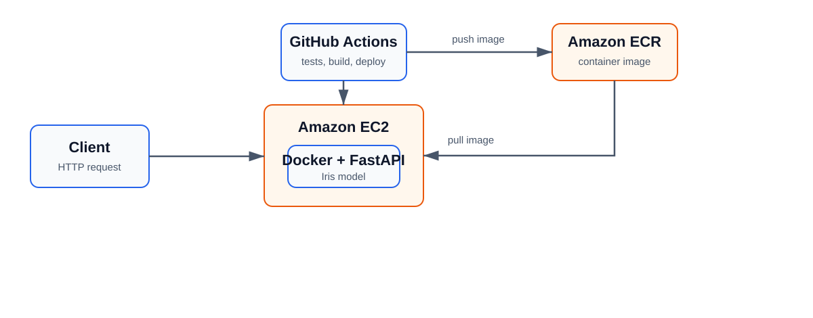
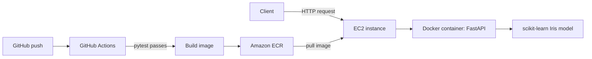

# Iris Model Deployment API

A small FastAPI service that predicts an Iris flower class from four measurements. The model is trained from scikit-learn's Iris dataset when the application starts, then served through a REST API.

The deployment target is a Docker container on an Amazon EC2 instance. Amazon ECR stores the image, and GitHub Actions tests the project before it builds or deploys an image.

## Architecture





## API

`GET /health`

```json
{"status":"ok"}
```

`POST /predict`

```json
{
  "sepal_length": 5.1,
  "sepal_width": 3.5,
  "petal_length": 1.4,
  "petal_width": 0.2
}
```

Example response:

```json
{
  "prediction": "setosa",
  "class_id": 0,
  "confidence": 1.0
}
```

## Run locally

Use Python 3.12.

```bash
python -m venv .venv
```

Windows PowerShell:

```powershell
.\.venv\Scripts\Activate.ps1
```

Install dependencies and start the service:

```bash
pip install -r requirements.txt
uvicorn app.main:app --reload
```

Open `http://127.0.0.1:8000/docs` for the interactive API page. Run the tests with:

```bash
pytest -q
```

## Run with Docker

```bash
docker build -t iris-classifier-api .
docker run --rm -p 8000:8000 iris-classifier-api
```

Then open `http://localhost:8000/docs` or request `http://localhost:8000/health`.

## CI/CD

`.github/workflows/ci.yml` runs on each push and pull request. Its Docker build job has `needs: test`, so it cannot run if the test job fails.

`.github/workflows/deploy.yml` runs tests again before it logs into ECR, pushes an image, and tells EC2 to replace the running container. Every later job depends on the previous job, so a failing test blocks build, ECR push, and deployment.

The deployment jobs stay disabled until the `DEPLOY_ENABLED` repository variable is set to `true`. This lets the first GitHub push run CI without failing because AWS secrets do not exist yet.

GitHub Actions alone reports a failed check; it does not stop someone with direct push permission from pushing a commit. To enforce the assignment requirement, create a branch rule for `main` after the first CI run:

1. In GitHub, open **Settings → Rules → Rulesets → New branch ruleset**.
2. Target the `main` branch and require a pull request before merging.
3. Require the `CI / test` status check and enable the option that requires the branch to be up to date.
4. Do not allow bypassing the rule for the account that normally pushes code.

With that rule, a failed test prevents merging into `main`; therefore the deployment workflow will not start from an untested main commit.

## AWS deployment setup

The included workflow is configured for `ap-south-1` and an ECR repository named `iris-classifier-api`. If another region or repository name is used, update both workflow files and both policy files before deploying.

1. In AWS ECR, create a **private** repository named `iris-classifier-api` in `ap-south-1`.
2. Create an IAM user or role for GitHub Actions. Attach a policy based on `aws/ci-deployer-policy.json`, replacing `ACCOUNT_ID` with the AWS account ID.
3. Create an Amazon Linux 2023 **x86_64** EC2 instance. Attach an instance role using `aws/ec2-ecr-pull-policy.json`, again replacing `ACCOUNT_ID`.
4. In the EC2 security group, allow inbound TCP port 80 for the people who need to view the demo. Allow inbound SSH port 22 only from the current public IP address. Do not open SSH to everyone.
5. Connect to the instance as `ec2-user`, copy the contents of `aws/ec2-setup.sh` into a file, run `bash ec2-setup.sh`, then disconnect and reconnect so the Docker group change takes effect.
6. In the GitHub repository, add these **Actions secrets** under **Settings → Secrets and variables → Actions**:

| Secret | Value |
| --- | --- |
| `AWS_ACCESS_KEY_ID` | Access key for the GitHub Actions deployer identity |
| `AWS_SECRET_ACCESS_KEY` | Matching secret access key |
| `EC2_HOST` | Public IPv4 address or public DNS name of the EC2 instance |
| `EC2_USER` | `ec2-user` for Amazon Linux |
| `EC2_SSH_PRIVATE_KEY` | The full contents of the private key that matches the EC2 key pair |

7. In the **Variables** tab at the same page, add `DEPLOY_ENABLED` with the value `true` after all AWS setup is complete.
8. Push to `main` or use **Actions → Deploy to AWS → Run workflow**. Watch the run until the `deploy` job succeeds.
9. Verify the real deployment at `http://YOUR_EC2_PUBLIC_IP/health` and `http://YOUR_EC2_PUBLIC_IP/docs`.

No AWS resource, credential, public address, or deployment result is included in this repository. Those steps must be completed in the AWS and GitHub accounts that own the project.

## Publish to GitHub

Create a new empty public repository on GitHub, then from this folder run:

```bash
git init
git add .
git commit -m "Build Iris model deployment API"
git branch -M main
git remote add origin https://github.com/YOUR_USERNAME/YOUR_REPOSITORY.git
git push -u origin main
```

After the first push, check the **Actions** tab and confirm that the `CI` workflow completed before setting the required status check rule.

## Project structure

```text
app/                 FastAPI application and model
tests/               API tests
.github/workflows/   CI and AWS deployment workflows
aws/                 IAM policy templates and EC2 setup script
Dockerfile           Container definition
```
